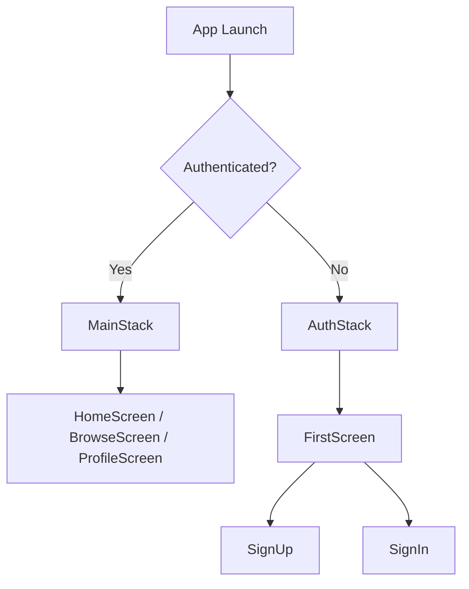

# Application Routing Guide

This guide explains the routing and navigation structure for the Habit Tracker app, detailing how screens and stacks are organized and switched based on authentication state.

## Overview

The app uses React Navigation with two primary navigation stacks:

- **AuthStack**: For unauthenticated users (onboarding, sign in, and sign up).
- **MainStack**: For authenticated users (main application tabs).

The app dynamically switches between these stacks based on whether a user is logged in.

## Navigation Flow



### 1. Entry Point

The main entry point for routing is in `App.js`:

- The navigation is wrapped with providers for authentication and user context.
- `AppNavigator` decides which stack to render:
  - If loading: shows a spinner
  - If user is authenticated: renders `MainStack`
  - Otherwise: renders `AuthStack`

### 2. AuthStack: Authentication Flow

Defined in `component/Navigation/AuthStack.js`.

- **Navigator**: Native stack navigator.
- **Screens**:
  - `FirstScreen` (Welcome screen)
  - `SignUp` (Sign in)
  - `SignIn` (Register)

**Initial route** is `FirstScreen`.

#### Example: Navigating from FirstScreen

```js
// In FirstScreen.js
navigation.navigate('SignUp') // Go to registration
navigation.navigate('SignIn') // Go to login
```

**FirstScreen UI:**
- Presents two actions: "Inscription" (register) and "Connexion" (login).

### 3. MainStack: Core App Flow

Defined in `component/Navigation/MainStack.js`.

- **Navigator**: Bottom tab navigator.
- **Tabs**:
  - `HomeScreen` (home)
  - `BrowseScreen` (explore)
  - `ProfileScreen` (user profile)

Custom SVG icons are used for each tab.

**Initial tab** is `HomeScreen`.

### 4. Navigation Container

The top-level navigation container is defined in `App.js`:

```js
<NavigationContainer>
  <AppNavigator />
</NavigationContainer>
```

Navigation is enabled throughout the app, allowing screen and tab transitions via `navigation.navigate()`.

## How Routing Works

1. **Authentication State**: 
   - The app observes authentication status via `useAuth()`.
2. **Switching Stacks**: 
   - If no user is logged in, the AuthStack is displayed (`FirstScreen` as entry).
   - After logging in or signing up, the MainStack replaces the AuthStack.
3. **Tab Navigation**: 
   - Inside MainStack, users navigate between main features (Home, Browse, Profile) via the tab bar (icons shown, no labels).

## Adding New Screens

To add a new screen:

- For authentication/onboarding:
  - Add screen component to AuthStack in `component/Navigation/AuthStack.js`.
- For main features:
  - Add screen component to MainStack in `component/Navigation/MainStack.js` and specify an icon.

Example of adding a new tab to MainStack:

```js
<Tab.Screen 
  name="StatsScreen"
  component={StatsScreen}
  options={{
    tabBarIcon: () => <StatsIcon width={24} height={24} />,
  }} 
/>
```

## Tips

- Use `navigation.navigate("<ScreenName>")` in components to change screens.
- Screen names must match those defined in each stack/tab navigator.

## Relevant Files

- `App.js`
- `component/Navigation/AuthStack.js`
- `component/Navigation/MainStack.js`
- `screens/FirstScreen.js`

For more on React Navigation, see the [official documentation](https://reactnavigation.org/docs/getting-started/).